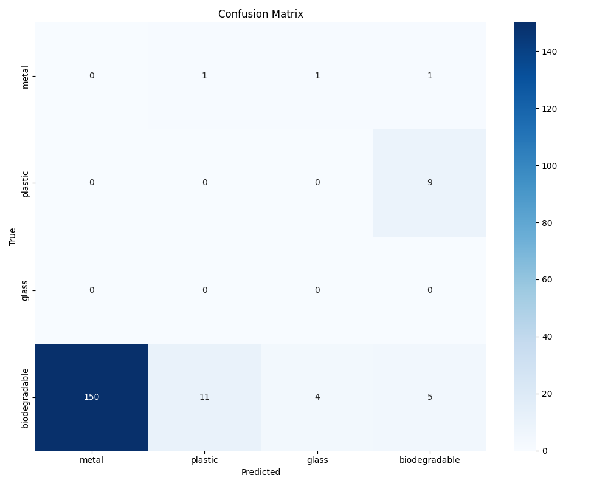

# Smart Waste Segregator

A bin that photographs whatever you throw into it and drops it into one of four
compartments: **biodegradable, plastic, metal, glass**.

A camera on the lid takes one photo when something goes in. A small classifier runs on
a Raspberry Pi and picks a class. Two servo-driven flaps route the item.

There are two generations here:

- `rpi-mobilenet/` is what actually ran on the bin, November 2024. PyTorch training,
  ONNX export, onnxruntime on the Pi.
- `yolo11-exports/` is me looking at YOLO11 for edge deployment four months later,
  March 2025. TorchScript and NCNN exports, nothing trained on waste.

Short version of how it went: the hardware worked, the classifier didn't. I trained it
on catalogue-style photos and then pointed it at a fixed overhead camera shooting
crumpled trash, and the two distributions have very little to do with each other. On
top of that my class grouping was badly skewed and I didn't correct for it. Details in
[Results](#results).

## Timeline

I wasn't using git in my third semester, so there's no commit history from the time.
I rebuilt this from file modification times in my backup folders. Those survive a copy
but a copy can also rewrite them, and these folders got moved around a few times, so
treat the dates as good evidence rather than proof.

| Date | What I was doing |
|---|---|
| 2024-10-11 | First code. `camera-test.py` trying to get a frame, and `exporter-v2-early.py`, a two-class MobileNetV2 export. Both dead ends, both kept below. |
| 2024-11-06 | Training. `sws.ipynb` 16:23, `waste_seg.ipynb` 17:44, then `best_model.pth` 18:41, `export.py` 18:43, `waste_classifier.onnx` 18:44 — the export happened three minutes after I had a checkpoint I liked. |
| 2024-11-07 | Putting it on the Pi, 02:33 to 10:21. `pir_test.py`, the three test photos, `smart_waste_segregation.py` at 10:17, `inference.py` at 10:21. This is the night I got the camera working. |
| 2024-11-13 | Tried to evaluate it. `confusion_matrix.png`, `error_log.txt`, `prediction_results.csv`, all 17:05. |
| 2024-11-23 | Last edits to the notebooks. |
| 2025-03-02/03 | Came back to it and did the YOLO11 exports in `yolo11-exports/`. |

The four weeks between the first camera attempt and a working capture is the honest
shape of this project. Most of my calendar went into hardware, not into the model or
the data, and that's the root of most of what follows.

## Hardware

- Raspberry Pi doing all the compute. No accelerator, nothing offboard.
- PiCamera, driven through `libcamera-still` at 2592x1944.
- LIDAR sensor as the trigger. The Pi idles, wakes on a trip, takes one photo,
  classifies, goes back to idle.
- PIR motion sensor on BCM pin 17 (`rpi-mobilenet/pir_test.py`), which I used as a test
  rig. It needs a full minute to settle before it reports anything useful.
- Two MG995 metal-gear servos on a dual-flap mechanism. I went with dual flaps because
  it was compact, and metal gears because plastic ones strip.

The LIDAR trigger is the decision I'd point to first. My original plan was to run a
continuous video stream and detect the object in frame. That pins the Pi's CPU and the
board overheats, and I spent a while chasing thermal throttling before realising I
didn't need continuous anything. One capture per LIDAR trip means the CPU is idle
between events, and the thermal problem disappeared.

### Getting a picture out of the camera

The Python camera bindings couldn't open the camera. The OS could — the device
enumerated fine, and `libcamera-still` from the shell gave me a JPEG every time. So the
hardware and driver were fine and the bindings were the broken layer.

`camera-test.py`, 11 October, is where I started. It dies on the second line:

```python
cap = cv2.VideoCapture(0)
if not cap.isOpened():
    print("Error: Camera not accessible")
    exit()
```

What I settled on four weeks later, in `smart_waste_segregation.py`, is to call the
tool that already worked and read the file back:

```python
command = [
    'libcamera-still',
    '-o', image_path,
    '--nopreview',
    '--width', '2592',
    '--height', '1944',
    '-t', '1000'
]
subprocess.run(command, check=True)
```

`libcamera-still` is the supported capture tool on the Pi — `libcamera` had replaced
the legacy camera interface and the Python bindings on that OS image weren't reliably
reaching it. Going through the CLI costs me one process spawn per photo, which is
nothing against a three second budget where I'm already waiting a full second for the
sensor to settle.

Two things in that call I'd defend if asked. I pass the command as a list rather than a
shell string, so I never have to think about quoting or filenames with spaces in them.
And `check=True` means a failed capture raises `CalledProcessError` right there, instead
of the run continuing and `cv2.imread` handing me a `None` further down that's much
harder to trace back.

## Pipeline (generation 1)

Trigger, capture, classify, actuate, under 3 seconds total. I picked a MobileNet-family
classifier rather than anything heavier specifically to hold that budget.

Preprocessing, the same in `inference.py` and `smart_waste_segregation.py`:

1. Read the JPEG with OpenCV.
2. BGR to RGB.
3. Resize to 224x224.
4. Scale to `[0, 1]`, then ImageNet normalization, mean `[0.485, 0.456, 0.406]`, std
   `[0.229, 0.224, 0.225]`.
5. Transpose HWC to NCHW, add a batch axis, cast to float32.

The model is a `torchvision` MobileNetV3-Small on ImageNet weights with the last
classifier layer swapped for a 4-way `Linear`. I exported it to ONNX at opset 11 with
`do_constant_folding=True`, input `input` and output `output`, dynamic batch axis.
Input `(1, 3, 224, 224)`, output `(1, 4)`, 6.1 MB on disk. The ONNX file records torch
2.4.1.

Session config on the Pi, from `smart_waste_segregation.py`:

```python
session_options = onnxruntime.SessionOptions()
session_options.graph_optimization_level = onnxruntime.GraphOptimizationLevel.ORT_ENABLE_ALL
session_options.intra_op_num_threads = 4

session = onnxruntime.InferenceSession(
    model_path,
    providers=['CPUExecutionProvider'],
    sess_options=session_options,
)
```

I do softmax by hand on the raw logits, subtracting the max first so the exponentials
don't overflow. The script prints the class, the confidence and the measured inference
time.

### Training runs

There are two training notebooks here and they're different experiments. Only one of
them produced what shipped.

`waste_seg.ipynb` is the one that shipped. MobileNetV3-Small, Adam at lr 0.001, 224x224.
I built the four classes by grouping source folders:

| Index | Class | Source folders |
|---|---|---|
| 0 | metal | `metal` |
| 1 | plastic | `plastic` |
| 2 | glass | `brown-glass`, `green-glass`, `white-glass` |
| 3 | biodegradable | `biological`, `paper`, `cardboard` |

6571 images, split 5256 train and 1315 validation, ten epochs. Best validation accuracy
91.63% at epoch 9. Per epoch:

| Epoch | 1 | 2 | 3 | 4 | 5 | 6 | 7 | 8 | 9 |
|---|---|---|---|---|---|---|---|---|---|
| Train acc | 84.59 | 91.67 | 94.86 | 96.50 | 96.29 | 97.13 | 97.55 | 97.49 | - |
| Val acc | 87.83 | 90.95 | 91.56 | 89.35 | 83.27 | 91.03 | 85.93 | 89.43 | 91.63 |

Looking at this now, training accuracy climbs to 97.5% while validation bounces around
between 83.3% and 91.6% and stops improving after epoch 3. Everything after that is me
fitting the training set harder. I took the 91.63% at face value at the time.

There's a second, longer run in the same notebook with heavier augmentation — random
resized crop, flips, colour jitter, Gaussian blur, rotation — on `OneCycleLR`, early
stopping patience 5, 20 epochs over 165 batches. I didn't keep its per-epoch output.

`sws.ipynb` is a separate MobileNetV2 attempt on a bigger merged dataset: 7324 images
from a YOLO-format set plus 15515 from a folder-per-class set, mapped to
`['organic', 'plastic', 'metal', 'glass']`, split 18271 train / 4568 validation. I
counted the classes on that one and it's badly skewed:

| Class | Images | Share |
|---|---|---|
| organic | 14707 | 64.4% |
| glass | 3863 | 16.9% |
| metal | 2588 | 11.3% |
| plastic | 1681 | 7.4% |

so I put a `WeightedRandomSampler` on it. That run didn't produce the deployed
checkpoint. `mobilenetv3-small/best_model.pth` on Hugging Face is the MobileNetV3-Small
state dict out of `waste_seg.ipynb`, and `waste_classifier.onnx` came from that. If you
want to confirm it's V3 and not V2, the ONNX graph has squeeze-and-excite blocks and
`HardSigmoid` nodes in it.

One thing to watch out for: I used three different class orderings across these files.
`waste_seg.ipynb` and `inference.py` use `['metal', 'plastic', 'glass', 'biodegradable']`,
which is the one that matches the weights. `sws.ipynb` uses
`['organic', 'plastic', 'metal', 'glass']`. And `smart_waste_segregation.py` — the file
that actually ran on the bin — uses `['plastic', 'paper', 'metal', 'glass']`, which is
wrong for the model it loads. So the Pi was printing the wrong class name even when the
argmax was right. I've left that line as it was and put a comment on it, because it's
part of what went wrong and I'd rather it stayed visible.

### Evaluation

`test.ipynb` is where I tried to score the ONNX model against a held-out YOLO-format
set. It wrote `confusion_matrix.png`, `prediction_results.csv` and `error_log.txt`.



It printed 2.75% accuracy over 182 images with 860 of 1042 skipped, and I want to be
clear that this number says nothing about the model. I broke the evaluation:

- The label files come from a six-class YOLO set (`BIODEGRADABLE`, `CARDBOARD`,
  `GLASS`, `METAL`, `PAPER`, `PLASTIC`). I read the raw class index and threw out
  anything at or above 4, which silently dropped every `PAPER` and `PLASTIC` image.
  That's the 860 failures in `error_log.txt`.
- Then I read the four surviving indices against a different four-class list, so a
  `METAL` image came out labelled `biodegradable`. You can see it straight from
  `prediction_results.csv`: `metal1000_jpg....jpg` has `true_class` recorded as
  `biodegradable`.

So the big 150-image cell in that confusion matrix is mostly my label mapping, not the
model getting things wrong. What I'm left with is worse in a quieter way: I never had a
valid held-out test set for this model.

#### Re-scoring it

The images are named after their class, so the filename gives me back the label I threw
away. `rescore_test.py` re-scores `prediction_results.csv` against it:

```bash
cd rpi-mobilenet
python rescore_test.py
```

| | |
|---|---|
| As scored by `test.ipynb` | **2.75%** (5 of 182) |
| Re-scored on filename labels | **88.9%** (152 of 171) |
| Validation accuracy in training | 91.63% |

That lands close to validation, which tells me the weights were fine and I'd broken the
harness around them.

I'm not going to claim 88.9% as a test accuracy, for four reasons the script prints
alongside the number:

1. What survived is 169 metal images and 2 plastic, so this is basically metal recall
   (150 of 169), not four-class accuracy.
2. The 11 `paper` files can't be scored at all — I folded `paper` and `cardboard` into
   `biodegradable` when training, so there's no unambiguous right answer for them
   against a four-class head.
3. These 182 rows are the leftovers from a harness that dropped 860 of 1042 images.
   That's not a split.
4. Validation was measured on the same distribution I trained on, so agreeing with it
   isn't strong evidence of much.

None of this changes the outcome. I still had no valid test set, and the bin still
classified badly for the reasons in [Results](#results). All the re-score buys me is
knowing that 2.75% was measuring my harness and not my model.

## Generation 2: YOLO11 exports

`yolo11-exports/model.ipynb` is exploratory and I'll say up front it's the thinnest part
of this repo. I took the stock Ultralytics `yolo11n` detection and `yolo11n-cls`
classification checkpoints and exported each to TorchScript and NCNN, NCNN being the one
worth having on a Pi-class CPU.

- Ultralytics 8.3.82, torch 2.6.0+cu118, CPU export.
- `yolo11n-cls`: 47 layers, 2,807,024 parameters, 4.2 GFLOPs, input `(1, 3, 224, 224)`,
  output `(1, 1000)`. TorchScript 10.9 MB, NCNN 10.7 MB.
- `yolo11n`: COCO detection, 80 classes, 640x640 input, stride 32.
- The NCNN export goes through `pnnx` and drops out `model.ncnn.param`,
  `model.ncnn.bin` and a generated `model_ncnn.py`.
- I ran the NCNN classifier on `bus.jpg` as a sanity check: 124.0 ms inference, 78.8 ms
  preprocess, 1.3 ms postprocess.

These are stock ImageNet and COCO weights. I never trained anything on waste here and
never put an NCNN model on the bin. It's export plumbing and one latency number.

## Weights

Nothing is committed here. The weights live on Hugging Face:

**https://huggingface.co/TheHelltaker/smart-waste-segregator**

```
mobilenetv3-small/
  best_model.pth            18.5 MB   trained state dict
  waste_classifier.onnx      6.1 MB   ONNX export, this is what runs on the Pi
yolo11/
  yolo11n.pt, yolo11n-cls.pt          stock Ultralytics checkpoints
  *.torchscript                       TorchScript exports
  yolo11n_ncnn_model/                 NCNN export
  yolo11n-cls_ncnn_model/             NCNN export
```

Fetch them with:

```bash
pip install -U huggingface_hub
hf download TheHelltaker/smart-waste-segregator --local-dir weights
```

## Repo layout

```
rpi-mobilenet/                    generation 1, the version that ran on the bin
  smart_waste_segregation.py      Pi runtime: libcamera-still capture, ONNX inference
  inference.py                    standalone classifier class, single image
  export.py                       PyTorch to ONNX, opset 11, with a parity check
  pir_test.py                     PIR sensor test rig, BCM pin 17
  waste_seg.ipynb                 MobileNetV3-Small training, produced the shipped weights
  sws.ipynb                       separate MobileNetV2 run on a larger merged dataset
  test.ipynb                      the evaluation I got wrong, wrote the artifacts below
  rescore_test.py                 re-scores that evaluation against filename labels
  confusion_matrix.png            evaluation output, read the caveat above first
  prediction_results.csv          per-image predictions, 182 rows
  error_log.txt                   860 images my label mapping dropped
  camera-test.py                  first camera attempt, OpenCV, didn't work
  exporter-v2-early.py            earliest code I still have, two-class MobileNetV2
  metal_test.jpg                  photos I took during bring-up
  pet_test.jpg
  plastic_test.jpg

yolo11-exports/                   generation 2, YOLO11 edge export experiments
  model.ipynb                     export runs and the NCNN sanity check
  bus.jpg                         Ultralytics sample images
  zidane.jpg
  pyproject.toml                  uv project, Python 3.13
  uv.lock
  main.py                         stub
```

## Running it

### On the Pi

Needs `onnxruntime`, `opencv-python`, `numpy`, and `libcamera-still` on the path.

```bash
cd rpi-mobilenet
python smart_waste_segregation.py
```

It counts down 5 seconds, captures at 2592x1944 to `waste_image.jpg`, classifies, and
prints the class, confidence and inference time. Point `model_path` at the
`waste_classifier.onnx` you downloaded, and fix `class_names` to
`['metal', 'plastic', 'glass', 'biodegradable']` before you trust the label it prints.

### On a single image, off the Pi

```bash
cd rpi-mobilenet
python inference.py
```

Defaults to `waste_classifier.onnx` and `metal_test.jpg`. Paths are at the top of
`main()`.

### PIR test rig

Needs `RPi.GPIO`. Wire the sensor to BCM 17 and give it a minute to settle.

```bash
python rpi-mobilenet/pir_test.py
```

### Re-export the ONNX model

```bash
cd rpi-mobilenet
python export.py
```

Loads `best_model.pth`, exports to `waste_classifier.onnx`, runs `onnx.checker`, and
checks the ONNX output against PyTorch at `rtol=1e-3, atol=1e-5`. The paths at the top
of `convert_to_onnx()` assume both files sit next to the script.

### YOLO11 exports

```bash
cd yolo11-exports
uv sync
uv run python -c "from ultralytics import YOLO; YOLO('yolo11n-cls.pt').export(format='ncnn')"
```

`ultralytics` isn't in `pyproject.toml`, so add it first. The committed exports came out
of 8.3.82.

## Results

Two subsystems, two very different outcomes.

### The hardware worked

None of the mechanical or electrical side was the limiting factor.

- **Latency.** Trigger to actuation stayed under 3 seconds. Most of that is the capture
  — I give `libcamera-still` a `-t 1000` settle before the shutter, plus process spawn
  and writing a 2592x1944 JPEG. Inference on a 6.1 MB MobileNetV3-Small under
  onnxruntime was never what I was waiting on.
- **Thermals.** The LIDAR trigger fixed the overheating. Continuous video decode held
  the CPU at load and the board throttled; one capture per trip leaves it idle.
- **Actuation.** The MG995 servos and the dual-flap mechanism took repeated cycles
  without stalling or drifting out of position.
- **Capture.** Reliable at 2592x1944 once I stopped going through the Python bindings.
- **Runtime.** onnxruntime on `CPUExecutionProvider` with `ORT_ENABLE_ALL` and 4
  intra-op threads sat comfortably inside the budget.

### The classifier didn't

I had 91.63% validation accuracy and a bin that misclassified constantly. Two reasons,
and both of them are things I did to the data rather than anything wrong with the model,
the export or the runtime.

**I trained on one distribution and deployed on another.** My training images are
catalogue photos — one object, centred, clean background, even lighting, shot at eye
level. What the bin sees is a fixed camera mounted above it at close range looking at
whatever landed inside: crumpled, dirty, half-occluded, at whatever angle it fell, under
room light that changes through the day. Those are not the same problem and I never
collected a single image through the deployed camera.

The last cell of `waste_seg.ipynb` already showed me this and I didn't read it properly
at the time. Three photos I took myself instead of pulling from the dataset:

| Image | Predicted | Confidence | Correct |
|---|---|---|---|
| `pet_test.jpg` | plastic | 88.49% | yes |
| `plastic_test.jpg` | metal | 79.02% | **no** |
| `metal_test.jpg` | metal | 90.70% | yes |

Three photos isn't a measurement, but the shape of the miss is the useful part: it's
wrong at 79% confidence with the right answer sitting at 12%. Confidently wrong is what
you get on inputs outside the training distribution, because softmax confidence isn't
calibrated out there. A model that was just short on capacity would hedge and spread the
probability instead of committing like that.

**I skewed the classes and didn't correct for it.** Look at the grouping table above:
`metal` and `plastic` each come from one source folder, while `glass` pulls from three
and `biodegradable` pulls from three. That puts roughly three times the source material
behind two of my four classes. I didn't print per-class counts in `waste_seg.ipynb`, so
I can't give the exact ratio for the run that shipped, and I used no class weighting or
balanced sampling in it. I clearly knew this was a problem in principle, because in
`sws.ipynb` I counted the classes on the merged dataset, found 64.4% organic against
7.4% plastic, and put a `WeightedRandomSampler` on it. I just didn't carry that back to
the run I actually deployed.

**And I couldn't measure any of it.** The only evaluation I did is `test.ipynb`, and I
broke it — six-class labels onto a four-class model, 860 of 1042 images dropped. So I
had no clean test set, no way to tell whether a change helped, and I ended up selecting
the model on validation accuracy computed over the same distribution I trained on. Which
is exactly the distribution that doesn't match the bin.

### What I'd do differently

Collect a few hundred images through the actual PiCamera, at the angle it's actually
mounted, under the light it actually sits in, and fine-tune on those. That attacks the
distribution problem head-on and gives me a test set from the deployment distribution at
the same time, which would also have made the class imbalance visible. I didn't do it
because the four weeks of camera bring-up in the [Timeline](#timeline) ate the schedule
I would have needed.

## Later edits to this repo

The code is the 2024 project. I've come back to it since, and I'd rather say exactly
what I touched than have it look like the original.

Added, from backup folders that were never in the working directory this repo came from:

- `rpi-mobilenet/camera-test.py`, the OpenCV capture attempt from 11 October 2024 that
  didn't work.
- `rpi-mobilenet/exporter-v2-early.py`, the oldest code I still have, a two-class
  MobileNetV2 ONNX export from the same day. Its checkpoint,
  `garbage_classifier_MN95.pth`, is gone, so it won't run. It's here for the date and to
  show where I started.
- `rpi-mobilenet/rescore_test.py`, which I wrote in 2026. It's analysis of the old
  artifacts, not project code.

Fixed in `smart_waste_segregation.py`, because these were plain bugs rather than
anything worth preserving:

- It captured to `metal_test.jpg`, one of my committed test photos, so every run
  overwrote it. It captures to `waste_image.jpg` now, which was already the capture
  function's own default.
- "Classify another object" called `main()` recursively, so the stack grew with every
  item. It's a loop.
- It rebuilt the onnxruntime session on every single classification. It builds once now,
  before the loop.

Left alone on purpose:

- `class_names` in `smart_waste_segregation.py` is still
  `['plastic', 'paper', 'metal', 'glass']`, which is wrong for the weights it loads.
  That one isn't a bug I want to hide — the mislabelled output is part of the story
  above. The line has a comment on it now. Use `inference.py` if you want the right
  label.

## Model weights and licences

The YOLO11 checkpoints on Hugging Face are the stock Ultralytics releases and carry the
AGPL-3.0 licence, as recorded in their `metadata.yaml`. `bus.jpg` and `zidane.jpg` are
Ultralytics sample images. The MobileNetV3-Small weights are mine, trained from
torchvision ImageNet weights.
